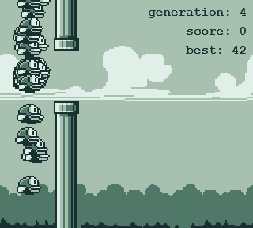

# Flappy

[Launch Flappy](https://deformhead.github.io/Flappy/index.html)

> *This project is an implementation of a Flappy Bird game with **machine learning** and **genetic algorithm***.

## Overview

The purpose of this project is understanding how a population of `Birds` with **artificial intelligence** would evolve playing a *Flappy Bird* game;

It uses an **artificial neural network** per `Bird` entity with a `4-4-1` shape like so :

- **4** inputs
    - `Bird` `y` position
    - `Bird` `y` `velocity`
    - `Pipe` `x` position
    - `Pipe` `y` position
- **4** hidden nodes
- **1** output telling if `Bird` should jump

When an entire **population** dies, a **genetic algorithm** performs the **selection** of the best `Bird` entity, retrieve its **artificial neural network**, mutates it to create a new **artificial intelligence** for each new `Bird` of the next **generation**.

[Launch Flappy](https://deformhead.github.io/Flappy/index.html)

---

This game is built with the [Theatre](https://github.com/theatrejs) game framework generator (see : [`generator-theatre`](https://github.com/theatrejs/generator-theatre)).

## [Change Log](./CHANGELOG.md)

## [License](./LICENSE)
